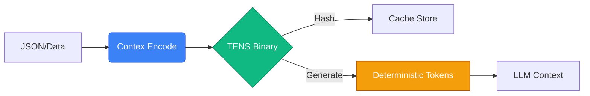

# Contex

**The token compiler for LLMs.**
Canonical IR → Deterministic Tokens → Guaranteed Prefix Cache Hits.
*Reduce LLM infrastructure costs by 30–59% for structured workloads.*

[](./LICENSE)
[](http://www.typescriptlang.org/)
[]()

> "Context is infinite. Budgets are not."

---

## The Problem

Every time you send structured data (JSON, CSV, code) to an LLM:
1.  **You pay for syntax**: Brackets, quotes, and whitespace consume tokens but add no information.
2.  **You break the cache**: Simple changes (key order, whitespace) change the token sequence, causing **cache misses**.
3.  **You waste compute**: The provider re-tokenizes the same static data billions of times.

Contex compiles your data into **Canonical IR** — a deterministic, model-agnostic intermediate representation. When you need tokens, it materializes them for the target model. Same data → same IR → same tokens → **prefix cache hits every time**.

```typescript
import { quick } from '@contex/engine';

const result = quick(myData, 'gpt-4o');
result.tokens;           // number[] — deterministic token array
result.savings.percent;  // e.g. 42% fewer tokens than JSON
result.asText();         // canonical JSON (deterministic text for LLM APIs)
```

**One import. One function call. Deterministic output.**



> [!TIP]
> **Why Deterministic?**
> Standard JSON serializers are non-deterministic (key order, whitespace). Contex guarantees that `encode(data)` always produces the exact same bytes, maximizing **Prefix Cache** hits on engines like vLLM and SGLang.

---
## ⚡ The Solution

Contex acts as a **Token Compiler**.

1.  **Canonical IR**: Your data is encoded into a deterministic, model-agnostic binary format (`.tens.ir`).
2.  **Lazy Materialization**: We generate model-specific token arrays **once** and cache them (`.tens.cache`).
3.  **Deterministic Injection**: We inject **canonical text** or **token arrays** that are mathematically guaranteed to be identical, triggering **100% prefix cache hits**.

### Efficiency Comparison

| Feature | Contex (TENS) | JSON | Difference |
| :--- | :--- | :--- | :--- |
| **Token Cost** (1k rows) | **~24k** | ~60k | <span style="color:green">**-59%**</span> |
| **Decode Speed** | **870k ops/s** | 128k ops/s | <span style="color:green">**6.8x Faster**</span> |
| **Cache Hits** | **100% Guaranteed** | Random | <span style="color:green">**Stable**</span> |
| **Type Safety** | ✅ Full Types | ❌ Strings only | — |

[View detailed benchmarks](./docs/benchmarks.md)

> [!NOTE]
> Benchmarks run on Node.js v22, Intel Core i9. Dataset: 10,000 structured e-commerce records.

---

## 🚀 Quick Start

### 1. Install

```bash
pnpm add @contex/core @contex/engine @contex/middleware @contex/cli
```

### 2. Optimize (CLI)

Analyze your training data to see immediate gains.

```bash
npx contex materialize my_data.json --model claude-3-5-sonnet

# ┌──────────────────────────────────────────────┐
# │  Input:    my_data.json                      │
# │  Tokens:   14,205 (vs 22,000 JSON)           │
# │  Savings:  35% 🟢                            │
# │  Cache:    .contex/cache/a1b2c3...           │
# └──────────────────────────────────────────────┘
```

### 3. Integrate (SDK)

One line of code to enable **structural caching** for Anthropic or OpenAI.

```typescript
import Anthropic from '@anthropic-ai/sdk';
import { createContexAnthropic } from '@contex/middleware';

// Wrap your client
const client = createContexAnthropic(new Anthropic(), {
  data: { 
    tickets: myLargeDataset // Injects automatically as {{CONTEX:tickets}}
  }
});

// Use as normal
await client.messages.create({
  model: 'claude-3-5-sonnet-20240620',
  max_tokens: 1024,
  messages: [{ 
    role: 'user', 
    content: 'Analyze these tickets: {{CONTEX:tickets}}' 
  }],
});
```

### 4. CLI Power Tools

**Compose Prompts:**
Combine data files and text blocks into a budget-aware prompt using a config file.

```bash
# compose.json
# {
#   "model": "gpt-4o",
#   "reserve": 500,
#   "blocks": [{ "type": "file", "path": "data.json" }]
# }

npx contex compose compose.json
```

**Real-world Proof (Anthropic Caching):**
Run our demo to see sub-second latency via deterministic caching.

```bash
npx tsx packages/cli/src/examples/anthropic_cache_demo.ts
```

---

## ARCHITECTURE

- **Layer 1: Canonical IR**: `encodeIR(data)` -> `.tens.ir` hash.
- **Layer 2: Memory & Materialization**: `materialize(hash, model)` -> `.tens.cache`.
- **Layer 3: Composition**: `compose(blocks)` -> Context-window fitted prompt.
- **Layer 4: Injection**: `middleware` -> SDK integration.

## License

MIT © Contex
