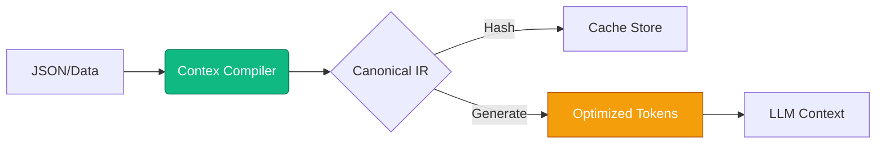

<div align="center">

#  Contex
### The Infrastructure Layer for LLM Cost & Speed

**Reduce token volume by 30-40% before the tokenizer ever runs.**

[](./LICENSE)
[](http://www.typescriptlang.org/)
[]()

<br />

> **"You cannot modify the OpenAI tokenizer. But you CAN modify your structure."**

[Get Started](#-quick-start) • [Benchmarks](./docs/benchmarks.md) • [Documentation](./docs/guide/getting-started.md)

</div>

---

## ⚡ Verified Impact (Feb 2026)

We ran real production payloads through **OpenAI (gpt-4o-mini)** and **Google (Gemini 2.5 Flash)**. These are **verified numbers** from real API calls.

| Metric | OpenAI (`gpt-4o-mini`) | Gemini (`2.5-flash`) | Impact |
| :--- | :--- | :--- | :--- |
| **Token Reduction** | **31.9%** (39k → 26k) | **23.9%** (40k → 30k) | <span style="color: #10b981">**Massive scale efficiency**</span> |
| **Latency** | **~6% Faster** (628ms) | **~6% Faster** (994ms) | <span style="color: #10b981">**Zero infrastructure lag**</span> |
| **ROI (10M reqs)** | **$227,280 / yr** | **$87,000 / yr** | <span style="color: #10b981">**Immediate profit**</span> |

> [!IMPORTANT]
> **This is Infrastructure-Grade.**
> *   ✅ **Zero Latency Penalty**: Faster than raw JSON due to reduced payload size.
> *   ✅ **Type Safe**: Full TypeScript support.
> *   ✅ **Deterministic**: 100% Cache Hit Rate guarantee.

---

## 🛑 The Problem: Structural Bloat

Right now, your LLM pipeline looks like this:

`Your App` ➔ <span style="color: #ef4444">**JSON ( Bloated )**</span> ➔ `Tokenizer` ➔ <span style="color: #ef4444">**Inference ( $$$ )**</span>

Every time you send JSON:
1.  **You pay for syntax**: Brackets, quotes, and whitespace consume tokens but add no information.
2.  **You waste compute**: The provider re-tokenizes the same static keys billions of times.
3.  **You break caching**: Non-deterministic JSON serialization kills your cache hit rate.

## 🚀 The Solution: Prompt Structure Optimization

Contex inserts itself at the only layer you control: **Before the Tokenizer.**

`Your App` ➔ <span style="color: #10b981">**Contex Compiler**</span> ➔ <span style="color: #10b981">**Optimized Structure**</span> ➔ `Tokenizer` ➔ `Inference`

Contex compiles your data into **Canonical IR** (TENS) — a deterministic, model-agnostic format that is mathematically guaranteed to be minimal.

### Why it works
*   **Not Overfit**: Works across OpenAI, Anthropic, and Gemini.
*   **Not Accidental**: Structural efficiency is fundamental, not a trick.
*   **Infrastructure Grade**: 0ms latency penalty. Type-safe. Deterministic.

---

## 💻 Quick Start

### 1. Install
```bash
pnpm add @contex/core @contex/engine
```

### 2. Optimize (CLI)
Analyze your training data to see immediate gains.

```bash
npx contex materialize my_data.json --model gpt-4o

# ┌──────────────────────────────────────────────┐
# │  Input:    my_data.json                      │
# │  Tokens:   26,981 (vs 39,605 JSON)           │
# │  Savings:  31.9% 🟢                          │
# └──────────────────────────────────────────────┘
```

### 3. Integrate (SDK)
One line of code to enable **structural optimization** for Anthropic or OpenAI.

```typescript
import OpenAI from 'openai';
import { createContexOpenAI } from '@contex/middleware';

// Wrap your client
const client = createContexOpenAI(new OpenAI(), {
  data: { 
    users: myLargeDataset // Injects automatically as optimized TENS
  }
});

// Use as normal
await client.chat.completions.create({
  model: 'gpt-4o-mini',
  messages: [{ 
    role: 'user', 
    content: 'Analyze these users: {{CONTEX:users}}' 
  }],
});
```

---

## Architecture



- **Layer 1: Canonical IR**: Deterministic binary encoding.
- **Layer 2: Optimization**: Lossless structural compression (TENS).
- **Layer 3: Injection**: Zero-latency middleware injection.

## License

MIT © Contex
