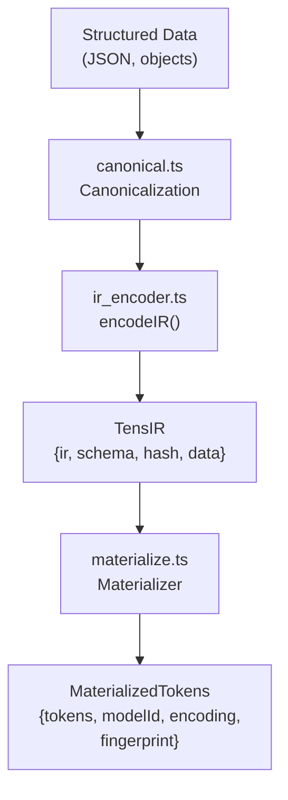
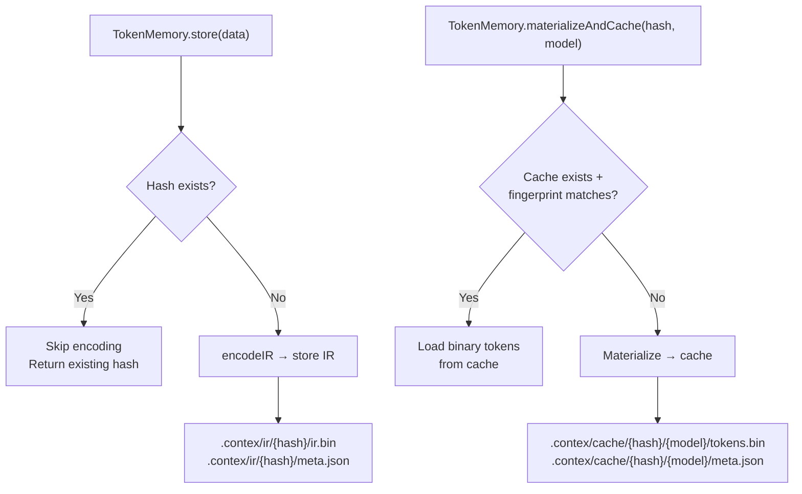
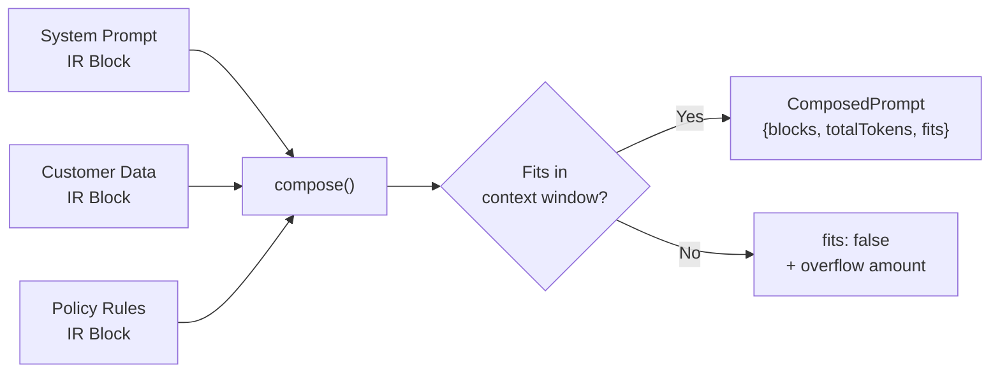
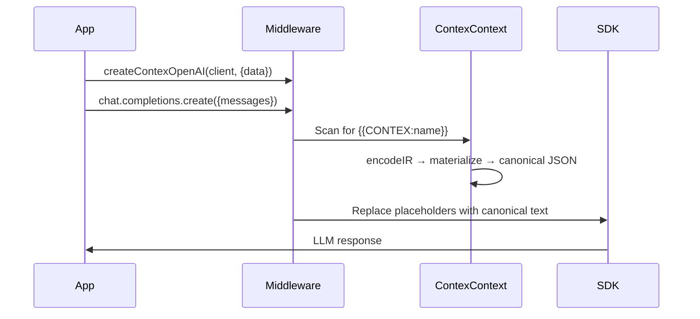
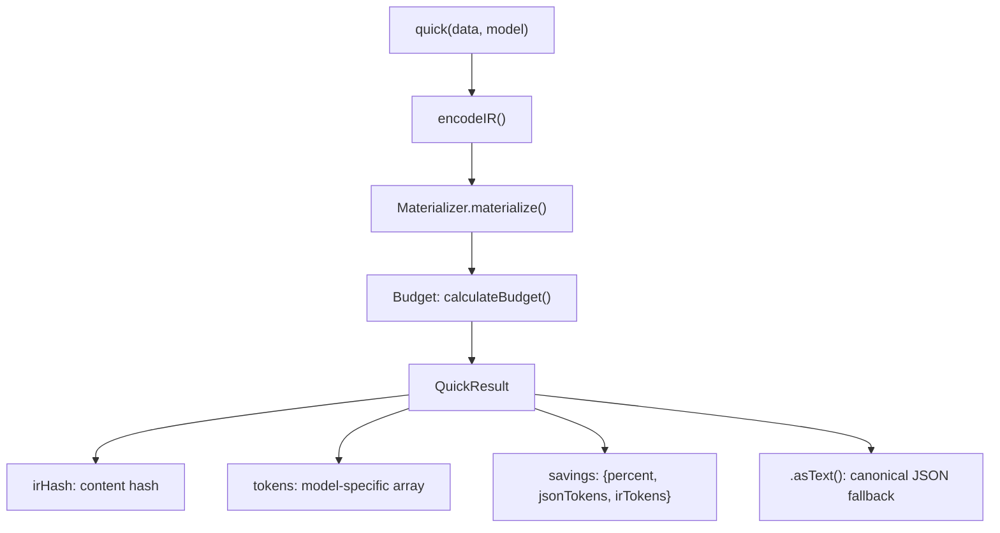
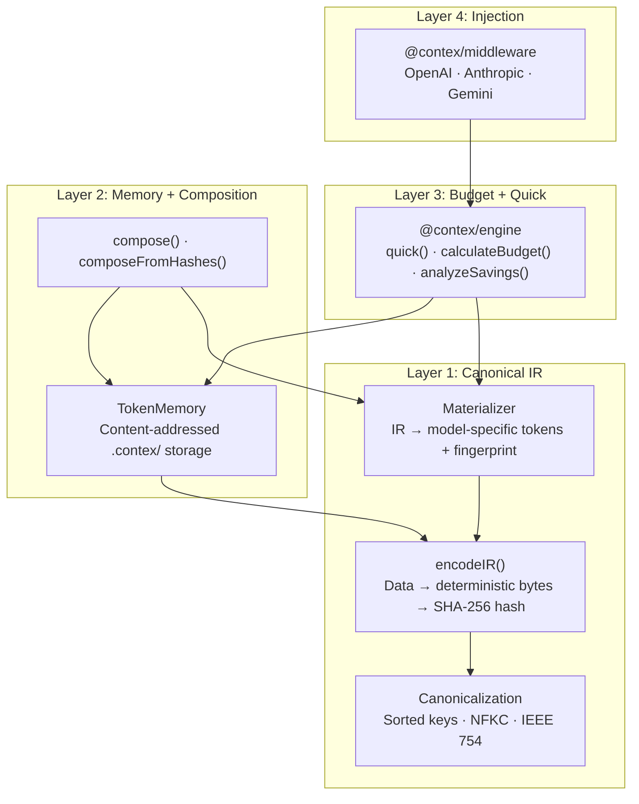

# Contex v3 — Complete Master Walkthrough

> Structure, theory, and what was built across all phases. No code — just architecture.

---

## The Problem Contex Solves

Every LLM API call today ships raw JSON text. The provider re-tokenizes it from scratch. This means:

- **Wasted compute**: Identical data tokenized thousands of times a day
- **Cache misses**: `{"a":1,"b":2}` and `{"b":2,"a":1}` produce different tokens → provider prefix cache miss
- **Token waste**: JSON syntax (brackets, quotes, repeated keys) consumes 30–60% of the context window

Contex eliminates all three by treating structured data the way compilers treat source code: **encode once into a canonical intermediate representation, materialize per target on demand.**

---

## The Compiler Analogy

| Traditional Compiler | Contex (Token Compiler) |
|---|---|
| Source code | Structured data (JSON, objects) |
| Compiler frontend | Canonical IR encoder |
| Object files (`.o`) | IR files (`.tens.ir`) |
| Linker | Token composer |
| Platform-specific binary | Model-specific token array |
| Runtime | LLM inference |

---

## Phase 1: Foundation — Canonical IR + Materialization

### What Was Built

**The core guarantee**: same data → same IR bytes → same hash → same tokens. Always.

Three new modules in `@contex/core`:



### Canonicalization Rules

The canonicalizer guarantees deterministic output:
- **Object keys**: sorted lexicographically (Unicode code point order)
- **Numbers**: shortest IEEE 754 representation (`1.5` not `1.50`, `1` not `1.0`)
- **Strings**: NFKC unicode normalization, trimmed whitespace
- **Nulls**: explicit marker (not omitted)
- **Arrays**: order preserved

### Materialization

The materializer converts model-agnostic IR into model-specific token arrays:
- Resolves which tokenizer encoding a model uses (e.g., GPT-4o → `o200k_base`)
- Tokenizes the canonical JSON representation
- **Fingerprints** the tokenizer output with a probe string — if `tiktoken` updates silently, the fingerprint changes and cached tokens are invalidated

### Key Design Decision: Why Not Store Tokens Directly?

Storing per-model tokens locks you to one model. If OpenAI updates their tokenizer, stored tokens become invalid. Storing for every model = storage explosion. **Canonical IR is model-agnostic; tokens are a cached materialization.**

### Verification
- 441 total tests across `@contex/core`
- Determinism tests: same data with shuffled keys, 1000 iterations, identical hash every time
- Roundtrip tests: encode → materialize → verify token counts match direct tokenization

---

## Phase 2: Token Memory — Content-Addressed Storage

### What Was Built

A persistent, content-addressed storage system for IR and materialized tokens.



### Storage Layout

```
.contex/
├── ir/
│   └── {sha256-hash}/
│       ├── ir.bin       ← Canonical IR bytes
│       └── meta.json    ← Schema, row count, version
└── cache/
    └── {ir-hash}/
        └── {model}.{encoding}.{version}/
            ├── tokens.bin  ← Int32Array binary cache
            └── meta.json   ← Fingerprint, token count
```

### Why Binary Token Cache?

`tokens.bin` stores raw `Int32Array` buffers — **4x smaller** than JSON arrays and instant to load (buffer read, no parsing). Paired with `meta.json` for integrity checking.

### Deduplication

Content-addressing means: if you store the same customer data twice, it encodes once. The second `store()` call detects the existing hash and returns immediately. This is fundamental to the "encode once, reuse forever" guarantee.

### Verification
- Store/load roundtrip tests
- Deduplication tests: duplicate data → `isNew: false`
- Binary cache read/write with fingerprint validation

---

## Phase 3: Token Composition — Multi-Block Prompts

### What Was Built

A composition engine that assembles prompts from multiple IR blocks with budget validation.



### Two Composition APIs

1. **`compose()`**: Takes raw data arrays, encodes IR on the fly, materializes, validates budget
2. **`composeFromHashes()`**: Takes pre-stored IR hashes from TokenMemory, loads and materializes — optimized for repeated compositions

### Budget Validation

Each composition validates against:
- Model's context window (from a registry of 33 models)
- Reserved tokens for system prompt
- Reserved tokens for response generation
- The result includes `fits: boolean` + exact token counts per block

### Why Composition Matters

Without composition, developers concatenate text strings and guess at token counts. With composition:
- **Exact budget**: know precisely how many tokens each block costs
- **Deterministic assembly**: same blocks → same composed output → prefix cache hits
- **Block reuse**: encode a policy document once, compose it into thousands of prompts

### Verification
- Multi-block composition with budget validation
- `composeFromHashes()` with TokenMemory integration
- Overflow detection tests

---

## Phase 4: Middleware Rewrite — Drop-In SDK Wrappers

### What Was Built

Three SDK wrappers (OpenAI, Anthropic, Gemini) that inject canonical IR-backed data into LLM API calls with zero code changes.



### Architecture: Shared `ContexContext`

All three wrappers share a common `ContexContext` class that:
1. Takes a `data` map (e.g., `{ tickets: [...], users: [...] }`)
2. On first access of each collection: encodes IR, materializes, generates canonical JSON
3. Caches the result — subsequent calls use the cached text
4. Reports injection metadata via `onInject` callback (collection, tokens, cache hit)

### Per-SDK Handling

| SDK | What Gets Wrapped | Special Handling |
|---|---|---|
| **OpenAI** | `chat.completions.create()` | Scans message `content` strings for `{{CONTEX:name}}` |
| **Anthropic** | `messages.create()` | Scans `system` field + all message content blocks |
| **Gemini** | `generateContent()` + `startChat().sendMessage()` | Handles both string and structured `contents` arrays |

### Why Text Fallback (Not Direct Token Injection)?

Current LLM APIs (Feb 2026) don't universally accept raw token arrays in chat completions. The middleware injects **canonical JSON text** — which, because it's canonicalized by the IR pipeline, produces deterministic tokens on the provider side, enabling prefix cache hits. When APIs evolve to accept token arrays directly, the middleware can switch without API changes.

### Verification
- 20 tests across 3 suites (OpenAI 9, Anthropic 5, Gemini 6)
- Placeholder replacement, nested content, cache hit reporting
- `startChat` wrapping for Gemini

---

## Phase 5: quick() Rewrite — One-Shot API

### What Was Built

The `quick()` function rewritten to return IR + tokens instead of just optimized text.



### Old vs New

| | v2 `quick()` | v3 `quick()` |
|---|---|---|
| **Returns** | `{ output: string }` | `{ irHash, tokens, savings, asText() }` |
| **Pipeline** | Text formatting + token counting | IR encode → materialize → budget |
| **Determinism** | Format-dependent | Guaranteed (canonical IR) |
| **Token access** | None (text only) | Full `number[]` array |
| **Backward compat** | N/A | `.asText()` returns canonical JSON |

### `analyzeSavings()` Rewrite

Also rewritten to use the IR pipeline. Compares JSON token count vs. IR-materialized token count across multiple models, computing percentage savings and dollar cost differences.

### Verification
- 10 tests (8 for `quick()`, 2 for `analyzeSavings()`)
- Determinism: same data → same `irHash` across calls
- `.asText()` backward compatibility

---

## Phase 6: Documentation Overhaul

### What Was Updated

Every external-facing document rewritten to reflect the v3 "token compiler" vision.

| Document | What Changed |
|---|---|
| **README.md** | Complete rewrite: IR pipeline, new quick() API, middleware with data option, architecture diagram |
| **docs/architecture.md** | IR-first pipeline diagram, package component tables, storage layout diagram, design decisions |
| **docs/PRD.md** | Repositioned as "token compiler", all phases marked complete, updated metrics |
| **docs/guide/getting-started.md** | All examples use `encodeIR`, `TokenMemory`, `compose`, data-driven middleware |
| **USE_CASES.md** | New multi-model use case, middleware use case, updated API calls |
| **CONTRIBUTING.md** | v3 terminology table, master doc reference, updated package descriptions |

### Terminology Standardization

Per the master doc's continuity rules, all docs now use consistent terms:

| Canonical Term | Replaces |
|---|---|
| **Canonical IR** | "intermediate representation", "data blob" |
| **Materialize** | "tokenize", "convert" |
| **Compose** | "assemble", "build", "concatenate" |
| **Inject** | "send", "pass" |
| **TokenMemory** | "storage", "database" |

---

## Phase 7: Cleanup

- Dead files already removed from root (idea.md, calculate_stats.js, etc.)
- `.gitignore` updated with `.contex/`, `.tens.ir`, `.tokens.bin`
- Root `package.json` description updated
- Fixed `Materializer()` constructor caught during final build verification

---

## Final Architecture



## Test Coverage Summary

| Package | Tests | Status |
|---|---|---|
| `@contex/core` | 441 | ✅ All passing |
| `@contex/engine` (quick) | 10 | ✅ All passing |
| `@contex/middleware` | 20 | ✅ All passing |
| **Total** | **471+** | ✅ |

All three active packages build clean with `tsc`.

---

## Phase 8: Developer Experience (In Progress)

### The Goal
Prove the value with end-to-end demos and developer-friendly tools.

### Planned Features
1. **CLI Commands**:
   - `contex materialize <file> --model <id>`: View tokens/stats
   - `contex compose <config.json>`: Assemble prompt
   - `contex inject <file> --provider anthropic`: Execute real call
2. **End-to-End Demo**:
   - `e2e_anthropic_cache.ts`: Prove 90% cost savings with real API
3. **Instrumentation**:
   - Measure internal latency (encoder/materializer)
   - Track cache hit rates

