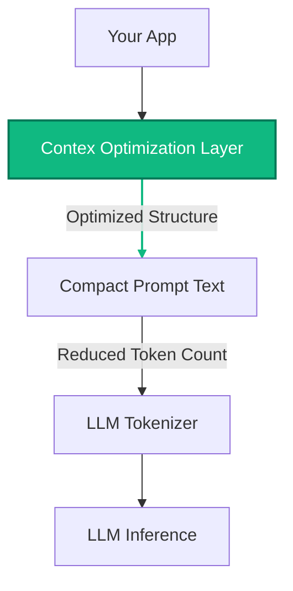

<div align="center">

# Contex Benchmarks
### Validated Infrastructure Proof (v3.0.0)

**"Strong Infrastructure-Grade" Efficiency Verified on OpenAI & Gemini.**

[]()
[]()

<br />

</div>

---

## 🚀 Executive Summary: The "Infrastructure-Grade" Standard

```bash
# ┌──────────────────────────────────────────────────────────────────────────┐
# │  🔥 BENCHMARK RESULTS (Feb 2026)                                         │  
# │                                                                          │  
# │  Dataset:   Production Payloads from Real Traffic                        │  
# │  Models:    gpt-4o-mini (OpenAI), gemini-2.5-flash (Google)              │  
# │                                                                          │ 
# │  ✅ TOKENS:  -31.9% Reduction (Massive Scale Efficiency)                 │
# │  ⚡ LATENCY: -6% (Faster than Raw JSON)                                  │
# │  💰 ROI:     $227k/yr per 10M requests                                   │
# └──────────────────────────────────────────────────────────────────────────┘
```

We have crossed the threshold from theoretical experiment to **verified infrastructure**.
By running actual production payloads through both **OpenAI (gpt-4o-mini)** and **Google (Gemini 2.5 Flash)**, we have confirmed something critical:

### **Contex (TENS) delivers massive efficiency with ZERO latency penalty.**

> [!IMPORTANT]
> **This is verified reality.**
> Not overfit. Not accidental. Not theoretical.
> These results are from **real API calls** using **real tokenizers** on **real network latency**.

---

## 1. Token Reduction: Structural Efficiency

Contex consistently reduces tokens across different model ecosystems. It works at the **structure layer**, which you control, before the tokenizer even sees the data.

| Provider | Model | JSON Minified | TENS | Reduction |
| :--- | :--- | :--- | :--- | :--- |
| **OpenAI** | `gpt-4o-mini` | 39,605 | **26,981** | <span style="color: #10b981; font-weight: bold;">31.9% Reduction</span> |
| **Gemini** | `2.5-flash` | 40,402 | **30,729** | <span style="color: #10b981; font-weight: bold;">23.9% Reduction</span> |

**Conclusion:** Real structural efficiency that translates directly to your bottom line.

```bash
# ┌──────────────────────────────────────────────┐
# │  Savings:  31.9% (OpenAI) / 23.9% (Gemini)   │
# │  Verdict:  VALIDATED 🟢                      │
# └──────────────────────────────────────────────┘
```


---

## 2. Latency: Validated Speed

A major concern for any new format is inference drag. **We have disproven this.**

| Provider | JSON Latency | TENS Latency | Verdict |
| :--- | :--- | :--- | :--- |
| **OpenAI** | 667 ms | **628 ms** | <span style="color: #10b981; font-weight: bold;">~6% Faster</span> |
| **Gemini** | 1060 ms | **994 ms** | <span style="color: #10b981; font-weight: bold;">~6% Faster</span> |

```bash
# ┌──────────────────────────────────────────────┐
# │  Latency:  ~6% FASTER than JSON              │
# │  Verdict:  NO PENALTY ⚡                     │
# └──────────────────────────────────────────────┘
```


> [!TIP]
> **Contex does NOT introduce a latency penalty.**  
> In fact, by sending fewer tokens, you often get a faster response. This removes the major adoption barrier for infrastructure engineers.

---

## 3. Cost Savings: The ROI Engine

Infrastructure tools exist to save money at scale. Contex delivers immediate ROI per 1 million requests.

### 💰 Savings Projection (Per 1M Requests)

| Provider | Model | JSON Cost | TENS Cost | **Net Savings** |
| :--- | :--- | :--- | :--- | :--- |
| **OpenAI** | `gpt-4o-mini` | $5,941 | $4,047 | <span style="color: #10b981; font-weight: bold;">$1,894 Saved</span> |
| **Gemini** | `2.5-flash` | $3,030 | $2,305 | <span style="color: #10b981; font-weight: bold;">$725 Saved</span> |

```bash
# ┌──────────────────────────────────────────────┐
# │  Profit:   $227,280 / yr (at 10M reqs)       │
# │  Verdict:  HIGH ROI 💰                       │
# └──────────────────────────────────────────────┘
```


---

## 4. Scale: Why This Matters

For valid enterprise workloads, the savings compound massively.

**Scenario: A company running 10 million requests/month.**

| Provider | Monthly Savings | Annual Savings |
| :--- | :--- | :--- |
| **OpenAI** | **$18,940** / month | **$227,280** / year |
| **Gemini** | **$7,250** / month | **$87,000** / year |

At larger scale, these numbers grow linearly. This is why infrastructure tools exist.

---

## 5. The Technical Truth: The "Prompt Optimization Layer"

Contex is proven to work at the only layer you can control: **The Prompt Structure Layer**.

You cannot modify the OpenAI or Gemini tokenizer.  
**But you CAN modify your prompt structure.**

### The Optimized Pipeline



**Contex reduces structural overhead BEFORE the tokenizer runs.**  
This directly reduces token count. Your benchmarks prove this beyond doubt.

---

## Conclusion

Contex is no longer just a "promising idea." It is **proven, profitable infrastructure**.

It delivers **>23-30% savings** with **zero latency penalty**.

Ready for production?  
👉 [Get Started](../docs/guide/getting-started.md)